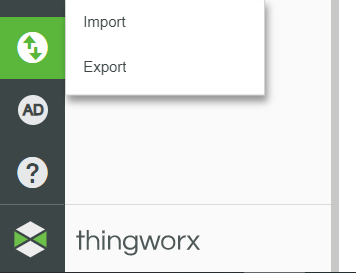
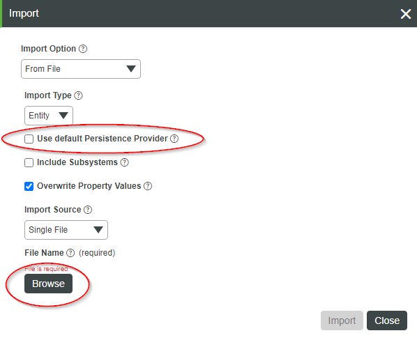
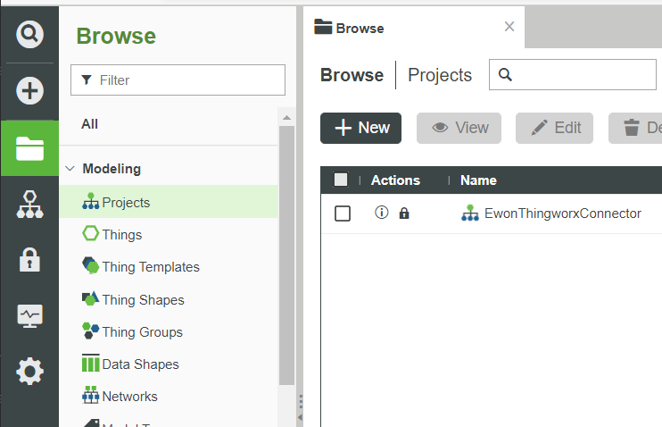
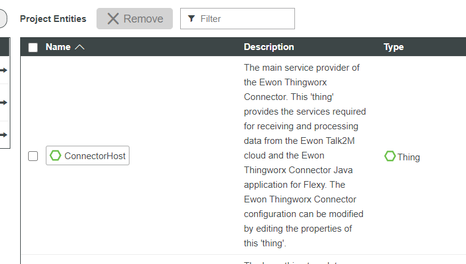
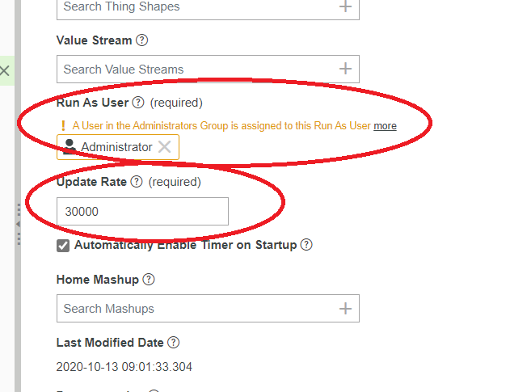
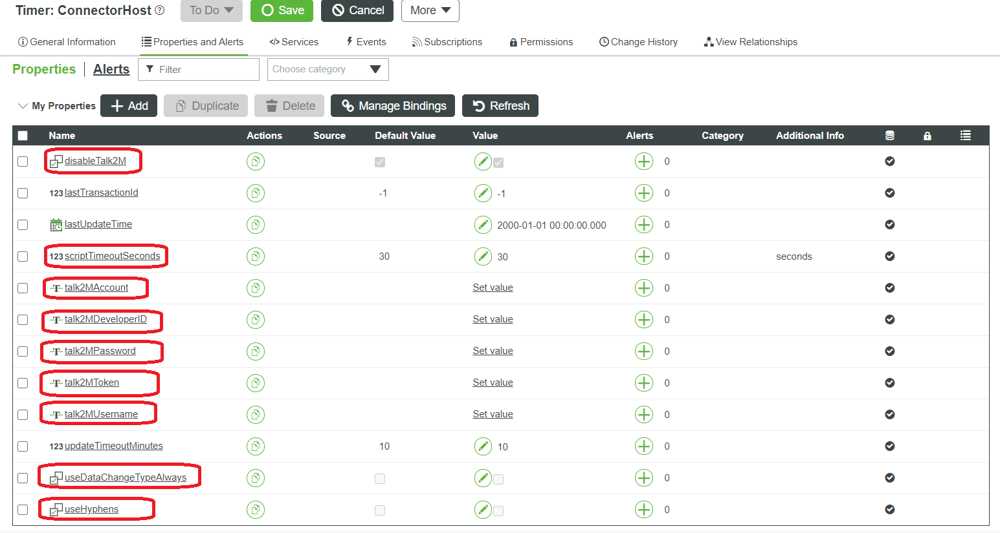

# Ewon Thingworx Connector

The Ewon Thingworx Connector package provides a connector-based solution to Thingworx for linking Ewon devices using the Talk2M cloud and/or Ewon Flexy devices using a direct data path with the Flexy Java application.

There are two components that make up the Ewon Thingworx Connector, a Thingworx project and an Ewon Flexy Java application.

## Table of Contents

1. [Data Paths](#data-paths)
2. [Thingworx Project Component](#thingworx-project-component)
   1. [Project Installation](#project-installation)
   2. [Thing Information](#thing-information)
      1. [ConnectorHost](#connectorhost)
      2. [GenericEwonDevice](#genericewondevice)
        1. [GenericEwonDeviceTalk2M](#genericewondevicetalk2m)
        2. [GenericEwonDeviceDirect](#genericewondevicedirect)
        3. [GenericEwonDeviceDirectStandalone](#genericewondevicestandalone)
      3. [GenericEwonDeviceValueStream](#genericewondevicevaluestream)
3. [Flexy Java Application Component](#flexy-java-application-component)
   1. [Installation](#installation)
   2. [Configuration](#configuration)
      1. [Thingworx Base URL](#thingworx-base-url)
   3. [Source Code](#source-code)
      1. [Development Environment](#development-environment)
   4. [Javadocs](#javadocs)

## Data Paths

The Ewon Thingworx Connector supports two data paths for receiving data from Ewon devices.

The first data path uses the Ewon Talk2M cloud and downloads data to Thingworx on a set timer interval.

The second data path uses a Flexy Java application to send data directly to Thingworx and does not require the use of any cloud platforms for data storage. It can provide the secure transfer of data on a local network.

Both data paths require the installation of the Thingworx Project Component, but the second data path also requires the installation of the Flexy Java Application Component.

## Thingworx Project Component

The Thingworx project component must be installed and configured for both data paths.

### Project Installation

To install the connector components for Thingworx, navigate to the lower left-hand corner of the screen, click the "Import/Export" button, then click "Import".



Configure following import options:
1. Check "Use default persistence provider".
2. Select Entities.xml from file system.

Click the "Import" button to complete the import.



**NOTE: Talk2M functionality has been disabled by default and must be configured prior to use.**

Navigate to the EwonThingworxConnector project by going to the "Browse" menu, then selecting the "Projects" tab.

Click the EwonThingworxConnector project to display its available entities.



Open the ConnectorHost timer Thing by clicking it under the list of available entities, then selecting "Edit".



On the General Information page, perform the following configuration modifications:

1. Configure "Run As User" to be something other than Administrator.
    
   1. The selected user must posses the permissions necessary for creating and modifying Things, and creating and updating Thing properties.

2. Configure "Update Rate" to the interval at which the connector should run (in milliseconds).

   1. This value is the interval at which data is downloaded from Talk2M/DataMailbox. If you are not using Talk2M functionality, this value does not need to be changed.



Navigate to the "Properties and Alerts" tab in ConnectorHost and populate the following property values:

1. *disableTalk2M*: When set to true, this disables the Talk2M/DataMailbox functionality. For direct data path users, this option may be set to `true`, but for Talk2M/DataMailbox data path users, this option must be set to `false`.

2. *scriptTimeoutSeconds*: This should match the scriptTimeoutSeconds value in the Thingworx platform-settings.json file. If you have not modified it, the default value is 30.

3. *talk2MAccount*: The account name for login to Talk2M.

4. *talk2MDeveloperID*: A valid Talk2M developer ID.

5. *talk2MPassword*: The account password for login to Talk2M.

6. *talk2MToken*: An account API token for access to Talk2M.

7. *talk2MUsername*: The account username for login to Talk2M.

8. *useDataChangeTypeAlways*: When set to true, the DataChangeType field of newly created properties will be set to 'Always'. The default value is `false`, which will result in newly created properties using the DataChangeType of 'Value'.

9. *useHyphens*: When set to true, additional organization is performed on Thing properties with a prefix in the name (i.e. PREFIX-\[tagname\]).

Additional and more detailed information about the properties of ConnectorHost can be found below in Thing Information > ConnectorHost > Properties.



### Thing Information

#### ConnectorHost

ConnectorHost is a timer Thing and triggers a check for new Talk2M data on its configured interval. In addition to checking Talk2M data on a set interval, ConnectorHost also provides the service required for direct data path connections.

##### Properties

1. *disableTalk2M*: A boolean property that controls the download and processing of data from the Ewon Talk2M cloud. The default value is `true`, thus this property must be changed to `false` for Talk2M functionality to work.

2. *lastTransactionId*: An integer property that the Talk2M services use to track the data that has been previously received. This property's value should not be manually changed and doing so may result in duplicate data entries or other unexpected behavior.

3. *lastUpdateTime*: A date/time property that the Talk2M and direct data path services use to track the last time data was successfully received. This property's value should not be manually changed and doing so may result in the delay of data without warning or other unexpected behavior. 

4. *scriptTimeoutSeconds*: An integer property that the Talk2M services use as a maximum time for fetching data. After the Talk2M data sync script has run for scriptTimeoutSeconds seconds, that iteration will be stopped. The value of this property should be equal to the configured scriptTimeoutSeconds value in the Thingworx platform-settings.json file. If you have not modified that file, the default is 30.

5. *talk2MAccount*: A string property that the Talk2M services use for Talk2M account authentication. The value of this property should be populated with the account name for your Talk2M account.

6. *talk2MDeveloperID*: A string property that the Talk2M services use for Talk2M developer identification. The value of this property should be populated with a valid Talk2M developer ID. If you do not have a Talk2M developer ID, you can apply for one at https://developer.ewon.biz/content/talk2m-developer-id.

7. *talk2MPassword*: A string property that the Talk2M services use for Talk2M account authentication. The value of this property should be populated with the account password for your Talk2M account.

8. *talk2MToken*: A string property that the Talk2M services use for Talk2M account authentication. The value of this property should be populated with a valid Talk2M account token from your Talk2M account. More information about Talk2M account API tokens can be found at https://onlinehelp.ewon.biz/ecatcher/6.6/pro/en/index.html?token-management.htm.

9. *talk2MUsername*: A string property that the Talk2M services use for Talk2M account authentication. The value of this property should be populated with the account username for your Talk2M account.

10. *updateTimeoutMinutes*: An integer property that the Talk2M and direct data path services use as the maximum number of minutes since last data update before showing a warning in the logs.

11. *useDataChangeTypeAlways*: A boolean property that the Talk2M and direct data path services use when creating new Thing properties. The default value is `false`. If the value is `true`, the DataChangeType field of newly created properties will be set to 'Always'.

12. *useHyphens*: A boolean property that controls the organization of Ewon devices and their tags. When tags use a hyphen prefix (i.e. PREFIX-\[tagname\]), a Thing will be created for each prefix (i.e. DEVICE-PREFIX) and each of the properties will be added. The default value is `false`.

##### Services

1. *InsertDataPoint*: Used by the Talk2M and direct data paths to insert a datapoint to the respective Thing and Thing property.

2. *MainExecution*: Used by the Talk2M data path for calling the Talk2MSyncData service within the script timeout period. This service is invoked by the ConnectorHost timer on its configured interval.

3. *ProcessTimeSinceUpdate*: Used by the Talk2M and direct data path services to track the time since the last received data update. This service is invoked by the MainExecution and TakeInfo services.

4. *TakeInfo*: Used by the direct data path to ingest telemetry messages from the Flexy Java Application component. This service is invoked by the Flexy Java Application component using the Thingworx REST API.

5. *Talk2MSyncData*: Used by the Talk2M data path for downloading a transaction of data points from Talk2M/DataMailbox. It requests only data it has not previously recieved using the stored value of lastTransactionId.

6. *AddNewDirectStandaloneDevice*: Used to create a new Thing for connecting an Ewon device using the standalone direct data path. Note: This service is for convenience, and application key permissions must still be manually configured. This service returns JSON containing the generated Thing name, data connection URL, application key name and value.

#### GenericEwonDevice

GenericEwonDevice is a Thing template that applies to all Ewon device Things created by the connector and contains common properties that are used by services in the GenericEwonDeviceTalk2M, GenericEwonDeviceDirect, and GenericEwonDeviceDirectStandalone Thing Templates.

##### Properties

1. *ewonDevicePassword*: The password of the referenced Ewon device. The default value is 'adm' and should be changed if your Ewon password is different. The value of this property is used by the services in the GenericEwonDeviceTalk2M, GenericEwonDeviceDirect, and GenericEwonDeviceDirectStandalone Thing Templates.

2. *ewonDeviceUsername*: The username of the referenced Ewon device. The default value is 'adm' and should be changed if your Ewon username is different. The value of this property is used by the services in the GenericEwonDeviceTalk2M, GenericEwonDeviceDirect, and GenericEwonDeviceDirectStandalone Thing Templates.

###### Services

1. *WriteBooleanTagGenericService*: A generic service used by the GenericEwonDeviceTalk2M, GenericEwonDeviceDirect, and GenericEwonDeviceDirectStandalone for writing a value to a boolean tag on the Ewon Device.

2. *WriteDwordTagGenericService*: A generic service used by the GenericEwonDeviceTalk2M, GenericEwonDeviceDirect, and GenericEwonDeviceDirectStandalone for writing a value to a DWORD tag on the Ewon Device.

3. *WriteFloatTagGenericService*: A generic service used by the GenericEwonDeviceTalk2M, GenericEwonDeviceDirect, and GenericEwonDeviceDirectStandalone for writing a value to a float tag on the Ewon Device.

4. *WriteIntegerTagGenericService*: A generic service used by the GenericEwonDeviceTalk2M, GenericEwonDeviceDirect, and GenericEwonDeviceDirectStandalone for writing a value to a integer tag on the Ewon Device.

5. *WriteStringTagGenericService*: A generic service used by the GenericEwonDeviceTalk2M, GenericEwonDeviceDirect, and GenericEwonDeviceDirectStandalone for writing a value to a string tag on the Ewon Device.

##### GenericEwonDeviceTalk2M

The GenericEwonDeviceTalk2M device template is for Ewon devices which connect to Thingworx using the Talk2M data path.

The GenericEwonDeviceTalk2M device template is based on the GenericEwonDevice device template, and inherits all of its services and properties.

###### Services

1. *SendEwonOffline*: Sends the referenced Ewon device offline when using a triggered connection, such as 3G or other cellular network. More information about triggered connections can be found at https://www.ewon.biz/e-learning/library/cosy-131/remote-connection#:~:text=Triggered%20Connection%3A%20wake%20up%20%26%20put,when%20the%20user%20needs%20it.

2. *WakeEwonDevice*: Wakes up the referenced Ewon device when using a triggered connection, such as 3G or other cellular network. More information about triggered connections can be found at https://www.ewon.biz/e-learning/library/cosy-131/remote-connection#:~:text=Triggered%20Connection%3A%20wake%20up%20%26%20put,when%20the%20user%20needs%20it.

3. *WriteBooleanTag*: Writes the value of a boolean tag on the Ewon device.

4. *WriteDwordTag*: Writes the value of a DWORD tag on the Ewon device.

5. *WriteFloatTag*: Writes the value of a float tag on the Ewon device.

6. *WriteIntegerTag*: Writes the value of a integer tag on the Ewon device.

7. *WriteStringTag*: Writes the value of a string tag on the Ewon device.

##### GenericEwonDeviceDirect

The GenericEwonDeviceDirect device template is for Ewon devices which connect to Thingworx using the direct data path and ConnectorHost's TakeInfo service.

The GenericEwonDeviceDirect device template is based on the GenericEwonDevice device template, and inherits all of its services and properties.

###### Properties

1. *talk2MDeviceName*: A string property that the GenericEwonDeviceDirect services use to identify the referenced Ewon on Talk2M. Devices connected using the direct data path may have a different name in Talk2M than what appears in Thingworx, thus it must be explicitly set for direct data path Things.

###### Services

1. *SendEwonOffline*: Sends the referenced Ewon device offline when using a triggered connection, such as 3G or other cellular network. More information about triggered connections can be found at https://www.ewon.biz/e-learning/library/cosy-131/remote-connection#:~:text=Triggered%20Connection%3A%20wake%20up%20%26%20put,when%20the%20user%20needs%20it.

2. *WakeEwonDevice*: Wakes up the referenced Ewon device when using a triggered connection, such as 3G or other cellular network. More information about triggered connections can be found at https://www.ewon.biz/e-learning/library/cosy-131/remote-connection#:~:text=Triggered%20Connection%3A%20wake%20up%20%26%20put,when%20the%20user%20needs%20it.

3. *WriteBooleanTag*: Writes the value of a boolean tag on the Ewon device.

4. *WriteDwordTag*: Writes the value of a DWORD tag on the Ewon device.

5. *WriteFloatTag*: Writes the value of a float tag on the Ewon device.

6. *WriteIntegerTag*: Writes the value of a integer tag on the Ewon device.

7. *WriteStringTag*: Writes the value of a string tag on the Ewon device.

##### GenericEwonDeviceDirectStandalone

The GenericEwonDeviceDirectStandalone Thing Template is for Ewon devices to connect to Thingworx using the direct data path with an independent application key and service endpoint.

The GenericEwonDeviceDirectStandalone Thing Template is based on the GenericEwonDeviceDirect Thing Template, and inherits all of its services and properties.

###### Properties

1. *lastUpdateTime*: A date/time property that is updated to the current time when a data update is received from the Ewon device.

###### Services

1. *InsertDataPoint*: Used by the TakeInfo service to insert a datapoint to its respective property on Thingworx.

2. *ProcessTimeSinceUpdate*: Used by the TakeInfo service to update the lastUpdateTime property which tracks when a data update was last received.

3. *TakeInfo*: Used by the Ewon device to ingest telemetry messages from the Flexy Java Application component. This service is invoked by the Flexy Java Application component using the Thingworx REST API.


#### GenericEwonDeviceValueStream

GenericEwonDeviceValueStream is a generic value stream Thing that is used for storing the values of its respective logged Thing properties.

### Common Errors

#### Error Executing Event Handler 'runConnector' for event Type.Thing:Entity.ConnectorHost:Event.Timer

This error is most commonly caused by invalid permissions for the ConnectorHost Thing.
To test, go to "ConnectorHost">"General Information" and change the value of "Run As User" to Administrator.

If the error resolves, there was an issue with the previous "Run As User" permission configuration.

#### Upon attempting to delete/input data into a Thing: "error: Thing X does not Exist"

This is an issue with Thingworx not being properly synced with the database provider.
Restarting Tomcat should fix the issue. For information on how to do this visit https://stackoverflow.com/questions/12622534/tomcat-restart-webapp-from-command-line

## Flexy Java Application Component
The Flexy Java application component must be installed for the direct data path configuration.

Additional documentation for the Flexy Java application is available in the Ewon Thingworx Connector Reference Guide, available for each release at [https://github.com/hms-networks/flexy-thingworx-connector/releases](https://github.com/hms-networks/flexy-thingworx-connector/releases).

### Installation
Using FTP, transfer the Flexy Java application \(.jar\) and jvmrun files to the /usr/ directory of the Ewon. Then, reboot the Ewon.

Those files are located in the /built-flexy-java-app/ directory of the release zip, found at [https://github.com/hms-networks/flexy-thingworx-connector/releases/latest](https://github.com/hms-networks/flexy-thingworx-connector/releases/latest). When building from source code, the jvmrun file is located in /scripts/, and the Flexy Java application \(.jar\) is located in /build/.

### Configuration
At startup of the Flexy Java application component, it checks for a configuration file in the /usr/ directory of the Ewon. If one is not present, the application will automatically create one with default values.

After the Flexy Java application component has been installed and started, the configuration should be modified to contain the proper values for AppKey and Thingworx Base URL for your Thingworx instance.
### Thingworx Base URL 
This parameter in the config file should be changed to the base URL for the target Thingworx REST API. Users should pay close attention to the scheme designated in the URL. Specifying the scheme "https" will ensure all traffic to the server is encrypted over TLS. For example, setting the ThingworxBaseUrl parameter to "https://example.com:8443" will create a connection to host "example.com" on port 8443 using TLS/SSL. It's possible to only specify the IP address of the Thingworx instance. This configuration will assume "http" scheme and communication will not be encrypted. 

### Source Code
Source code and an Eclipse project for the Flexy Java app are made available in the [hms-networks/flexy-thingworx-connector](https://github.com/hms-networks/flexy-thingworx-connector) repository on GitHub. It is also included in the /source-flexy-java-app/ folder of Flexy Thingworx Connector release \(.zip\) files.

#### Development Environment
The Flexy Java application component was developed using a standard Ewon Java development environment. Documentation and additional information about the Ewon Java development environment is available in the Ewon Java Toolkit User Guide \(J2SE\) at [https://developer.ewon.biz/content/java-0#dev-documents](https://developer.ewon.biz/content/java-0#dev-documents).

### Javadocs
Developer documentation is available in Javadoc format in doc folder of release package. Javadocs can also be generated by the following bash command: 
```bash
javadoc -private -splitindex -use -author -version -d docs -classpath  $(find src/ -name "*.java")
```

For windows command prompt: 
```shell
dir  /s /B *.java > sources.txt
javadoc -private -splitindex -use -author -version -d docs -classpath @sources.txt
del sources.txt
```